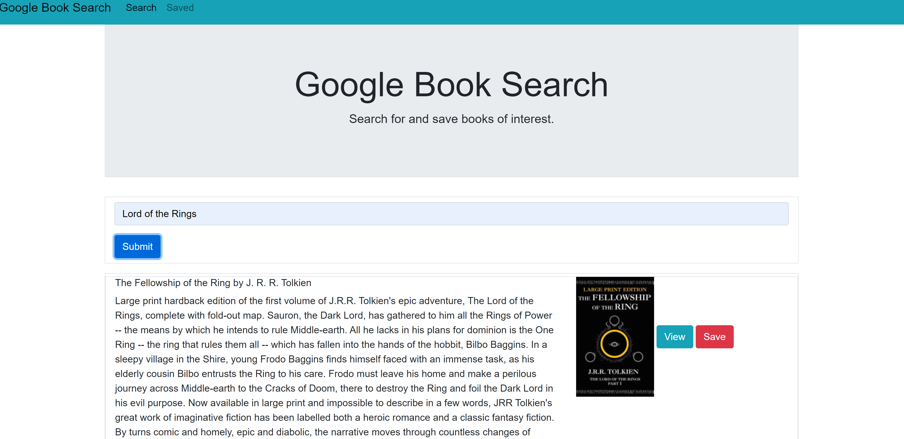

  # React Google Book Search
  
  ## GitHub Username:
  Nolanbt

  ## Email: 
  nbakert@gmail.com

  ## Table of Contents
  * [Description](###Description)
  * [Installation](###Installation)
  * [Links](###Links)

  ### Description
  A react application that allows the user to search with the google books api. It also allows the user to view the book details and save/delete from for later reference.

  ### Installation
  npm i

  ### Links
  https://arcane-mountain-67471.herokuapp.com/

  
